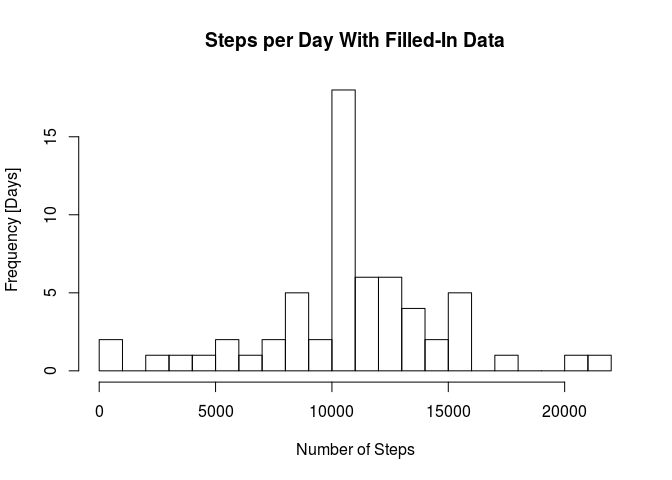

# Reproducible Research: Peer Assessment 1
# Reproducible Research Course Project 1
## by E. H., October 6, 2016

## Loading and preprocessing the data

Load the activity data into R and add a datetime column:

```r
movement.data <- read.csv("activity.csv",  
                          colClasses = c("integer", "character", "integer"))

movement.data$datetime <- as.POSIXct( strptime(paste(
    movement.data$date, sprintf("%04d", movement.data$interval), sep = " "),
    "%Y-%m-%d %H%M"))

head(movement.data)
```

```
##   steps       date interval            datetime
## 1    NA 2012-10-01        0 2012-10-01 00:00:00
## 2    NA 2012-10-01        5 2012-10-01 00:05:00
## 3    NA 2012-10-01       10 2012-10-01 00:10:00
## 4    NA 2012-10-01       15 2012-10-01 00:15:00
## 5    NA 2012-10-01       20 2012-10-01 00:20:00
## 6    NA 2012-10-01       25 2012-10-01 00:25:00
```

## What is mean total number of steps taken per day?

Calculate the total number of steps taken per day:

```r
library(dplyr)
```

```r
by_day <- group_by(movement.data, date)
steps.per.day <- summarise(by_day, steps.per.day = sum(steps, na.rm = TRUE))  
```

Histogram of the total number of steps taken each day:

```r
breaks <- ceiling(max(steps.per.day$steps.per.day)/1000)
hist(steps.per.day$steps.per.day, breaks = breaks, 
     main = "Steps per Day" ,xlab = "Number of Steps", ylab = "Frequency [Days]" )
```

<!-- -->

Calculation of the quantiles and the mean of the total steps per day: {#OriginalSummary}

```r
summary(steps.per.day$steps.per.day)
```

```
##    Min. 1st Qu.  Median    Mean 3rd Qu.    Max. 
##       0    6778   10400    9354   12810   21190
```

## What is the average daily activity pattern?

Time series plot of the number of steps taken, averaged across all days. 
NA values are removed.

```r
library(ggplot2)
library(scales)
```

```r
by_interval <- group_by(
    movement.data, 
    # move all dates to the same day (which happens to be today)
    time.of.day = 
        as.POSIXct(
            format(movement.data$datetime, format = "%H:%M"), format = "%H:%M",
            tz = "UTC"))
steps.per.interval <- summarise(
    by_interval, steps.per.interval = mean(steps, na.rm = TRUE)) 

p <- ggplot(steps.per.interval, aes(time.of.day, steps.per.interval))

p + labs(title = "Average Number of Steps per 5 Minute Time Interval") +
    geom_line() +
    scale_x_datetime(labels = date_format("%H:%M"))
```

<!-- -->

The maximum number of steps for a 5 minute interval is in the morning hours
as can be seen in the previous plot.

```r
maxvalue <- subset(
    steps.per.interval, steps.per.interval == max(steps.per.interval))
c(format(maxvalue$time.of.day, "%H:%M"), maxvalue$steps.per.interval)
```

```
## [1] "08:35"            "206.169811320755"
```

## Imputing missing values

Total number of missing values in the dataset:

```r
nrow(subset(movement.data, is.na(movement.data$steps)))
```

```
## [1] 2304
```

The missing values can be assumed e.g. by the mean for the corresponding time
interval. Replace the NA values by these values: 

```r
library(data.table)
```


```r
# Copy the original data table and add a column to compare and join with
# steps.per.interval$time.of.day
# time.of.day has date of today, but only the time interval is used
movement.data.filled <- copy(movement.data)
movement.data.filled$time.of.day = 
        as.POSIXct(
            format(movement.data$datetime, format = "%H:%M"), format = "%H:%M",
            tz = "UTC")
movement.data.filled <- left_join(movement.data.filled, steps.per.interval, 
                                  by = "time.of.day")
movement.data.filled$steps.filled <- ifelse(
    is.na(movement.data.filled$steps),
    movement.data.filled$steps.per.interval,
    movement.data.filled$steps)
```

Histogram of the total number of steps taken each day with missing data filled in:


```r
by_day_filled <- group_by(movement.data.filled, date)
steps.per.day.filled <- summarise(
    by_day_filled, steps.per.day.filled = sum(steps.filled, na.rm = TRUE))  
```

Inspect the observations with NA values:

```r
filled <- subset(movement.data.filled, is.na(steps))
na_dates <- group_by(filled, date)
summarise(na_dates, steps.per.day = sum(steps.filled))
```

```
## # A tibble: 8 × 2
##         date steps.per.day
##        <chr>         <dbl>
## 1 2012-10-01      10766.19
## 2 2012-10-08      10766.19
## 3 2012-11-01      10766.19
## 4 2012-11-04      10766.19
## 5 2012-11-09      10766.19
## 6 2012-11-10      10766.19
## 7 2012-11-14      10766.19
## 8 2012-11-30      10766.19
```

The na_dates are a dataframe of 8 groups and $8 days * 288 observations per day = 2304 observations$. That means there are eight whole days with missing steps.


```r
breaks <- ceiling(max(steps.per.day.filled$steps.per.day.filled)/1000)
hist(steps.per.day.filled$steps.per.day.filled, breaks = breaks, 
     main = "Steps per Day With Filled-In Data" ,
     xlab = "Number of Steps", ylab = "Frequency [Days]" )
```

<!-- -->

The histogram with filled-in data differs from the original one by the eight days filled by daily mean distribution. In the original data these days were counted with 0 steps per day, now they have 10766.19 steps per day and thus were moved to the 10000..11000 bin.

Calculation of the quantiles and the mean of the total steps per day for filled table:

```r
summary(steps.per.day.filled$steps.per.day.filled)
```

```
##    Min. 1st Qu.  Median    Mean 3rd Qu.    Max. 
##      41    9819   10770   10770   12810   21190
```

Both, mean and median have increased compared to the [original data](#OriginalSummary).  


## Are there differences in activity patterns between weekdays and weekends?

Add a factor variable in the dataset with two levels – “weekday” and “weekend” indicating whether a given date is a weekday or weekend day:


```r
library(chron)
```


```r
movement.data.filled$weekday <- as.factor(
    ifelse(
        is.weekend(as.Date(movement.data.filled$date)),
        "weekend",
        "weekday"))
```


```r
g = ggplot(movement.data.filled, aes(x=time.of.day, y=steps.filled))
g + geom_line(aes(y=steps.filled), stat="summary", fun.y = "mean") + facet_grid(weekday~.)
```

<!-- -->


```
